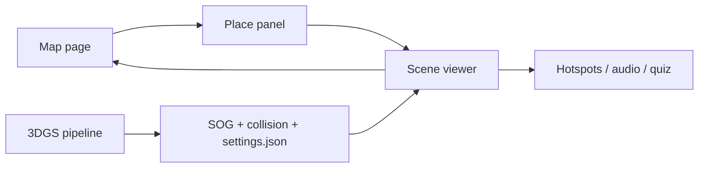

# Architecture

## Product Shape

The first screen is the map. Users do not land on marketing copy; they land on an operational map with place markers and a place list.



## Proposed Monorepo

```text
.
|-- apps/
|   `-- web/
|       |-- src/app/              # Next.js App Router
|       |-- src/features/map/     # MapLibre UI
|       |-- src/features/scene/   # Viewer shell and scene manifests
|       `-- src/data/             # temporary seed data before DB
|-- packages/
|   |-- db/                       # Kysely client, generated DB types, query helpers
|   |-- shared/                   # shared types
|   |-- assets/                   # storage keys and scene manifest utilities
|   `-- ui/                       # shared UI only after duplication appears
|-- db/
|   `-- migrations/               # SQL source of truth
|-- tools/
|   |-- 3dgs/                     # asset pipeline scripts later
|   `-- maps/                     # map tile generation scripts later
|-- infra/
|   `-- docker/                   # local PostGIS/MinIO/Redis/Martin later
|-- docs/
`-- public/
    `-- sample-data/
```

## Frontend

Recommended stack:

- Next.js 16 App Router
- React 19
- TypeScript
- Tailwind CSS
- MapLibre GL JS
- PlayCanvas/SuperSplat Viewer via self-hosted viewer route or embedded iframe first

Routes:

- `/`: map-first browse experience.
- `/places/[slug]`: place detail with metadata, availability, and "enter 3D" action.
- `/viewer/[sceneId]`: full-screen 3D scene viewer.
- `/admin`: later, for place/scene management.

## Backend And Storage

Decision:

- PostgreSQL + PostGIS is the system of record.
- Docker Compose is the first runtime harness for Postgres/PostGIS, object storage, and the web app.
- SQL migrations live in `db/migrations`.
- Kysely is the TypeScript query builder once DB queries move out of seed data.
- Next.js route handlers/server functions handle early APIs.

Storage:

- S3-compatible object storage such as MinIO locally, then Cloudflare R2, GCS, or S3 later.
- Storage keys are stored in Postgres; public URLs are derived at runtime.
- Raw capture assets stay private.
- Published SOG/poster/settings/collision assets can become public after review.

## Data Model Draft

```text
places
  id
  slug
  name
  category
  description
  geom public.geometry(Point, 4326)
  address
  ward
  district
  city
  status
  created_at
  updated_at

scenes
  id
  place_id
  slug
  title
  entry_label
  status

scene_versions
  id
  scene_id
  version
  renderer
  source_format
  runtime_format
  content_key
  settings_key
  collision_key
  poster_key
  entry_pose
  quality_profile
  training_metadata
  status

hotspots
  id
  scene_version_id
  title
  body
  position
  kind
  payload

capture_sessions
  id
  place_id
  scene_id
  device
  raw_asset_key
  status

processing_jobs
  id
  capture_session_id
  scene_version_id
  provider
  gpu_type
  toolchain
  status
  config
  log_key

assets
  id
  owner_type
  owner_id
  kind
  storage_bucket
  storage_key
  visibility
```

Use `geom public.geometry(Point, 4326)` now, not separate `lat/lng` fields as the source of truth. Create a `GiST` index for spatial queries.

## 3D Asset Contract

Each scene should publish a manifest:

```json
{
  "sceneId": "home-room-v1",
  "format": "sog",
  "contentUrl": "https://.../scene.sog",
  "settingsUrl": "https://.../settings.json",
  "collisionUrl": "https://.../scene.voxel.json",
  "posterUrl": "https://.../poster.webp",
  "entryPose": {
    "position": [0, 1.6, -2],
    "target": [0, 1.4, 0],
    "fov": 60
  }
}
```

The web app consumes this contract without caring whether the scene was trained by Nerfstudio, Postshot, RadianceKit, or another tool.

## Mobile Constraints

- Load one scene at a time.
- Use SOG, not raw PLY, for runtime.
- Provide poster and loading state.
- Detect low-memory/mobile devices and allow lower splat budget.
- Keep map and viewer separate routes so the map can unload while the viewer runs.

## Why This Split Works

The hardest uncertainty is 3DGS capture/training quality, not web UI. A manifest boundary lets us build the product shell now and swap training tools later without rewriting the app.
